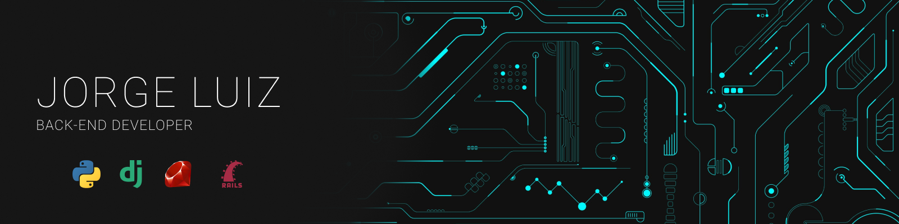

## a little about me 

Atualmente graduando em Sistemas de Informações pela <a href="https://unifapce.edu.br/">UNIFAP-CE</a>, sou apaixonado por tecnologia desde criança e me encontrei na programação, sou desenvolvedor backend utilizando principalmente python, mas também possuo conhecimento de frontend, banco de dados e organização e desenvolvimento de projetos.
Gosto de experimentar coisas novas, adoro concluir desafios, estando sempre a procura de me desenvolver pessoal e profissionalmente.

<a style="white-space: nowrap;" href="https://github.com/odevjorge">
    

        
        
    

</a>

## studying now

## knowledge in 

## tools

## curiosity in

## social media and contacts

 

https://github.com/odevjorge/odevjorge/blob/output/github-contribution-grid-snake-dark.svg)
